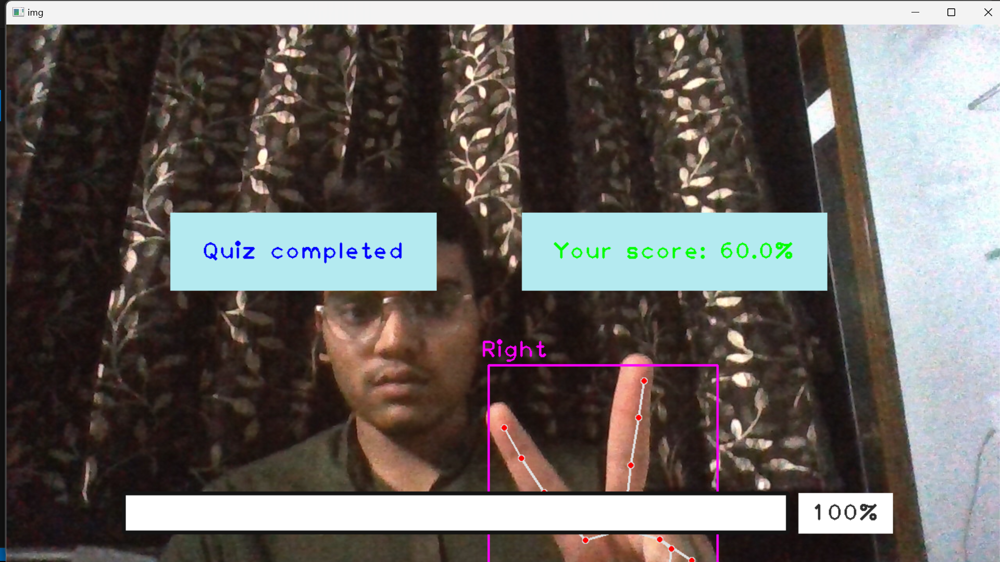

## Virtual Quiz Game

<details open="open">
  <summary>Table of Contents</summary>
  <ol>
    <li>
      <a href="#Technologies">Technologies</a>
    </li>
    <li>
      <a href="#Example">Example</a>
    </li>
    <li>
	    <a href = "#How-to-Start-Project">How to Start Project</a>
    </li>
    <li>
	    <a href = "#Contact-Us">Contact Us</a>
    </li>
    <li>
	    <a href = "#License">License</a>
    </li>
  </ol>
</details>

## Technologies
- Python
- opencv-python
- cvzone
- mediapipe

## Example:


<div style="display:flex; flex-wrap:wrap; gap:2%; justify-content:center;">




</div>

## How to Start Project

Follow these steps to get started with the project:

1. **Clone the Repository:**
   ```bash
   git clone <repository_link>
   ```
2. **Install Anaconda:**
   
   Make sure you have Anaconda installed on your system. If not, you can download and install it from the official website: https://www.anaconda.com/download/
   
4. **Create a Virtual Environment:**
   
   Create a new virtual environment using Python 3.8:

   ```bash
   conda create --name your_env_name python=3.8 -y
   ```
   Replace your_env_name with the desired name for your virtual environment.
   
   Activate the newly created environment:
   ```bash
   conda activate your_env_name
   ```
5. **Install Dependencies:**
   
   Install the project dependencies by running:
   ```bash
   pip install -r requirements.txt
   ```
   This command will install all the required packages listed in the requirements.txt file.

6. **Put Questions**

    Put csv file containing quiz questions into Data folder.

7. **Run the Quiz App:**
   ```bash
   main.py
   ```
   This command will start the virtual Quiz.

## Contact Us

To learn more about, please reach out:

📧 suzalkachhadiya111@gmail.com

## License

This project is licensed under the MIT License - see the [LICENSE](LICENSE) file for details.